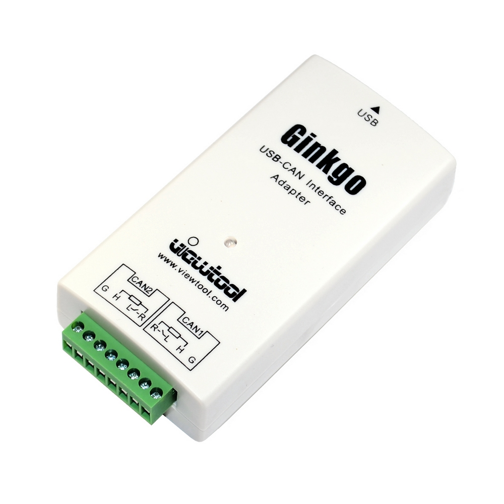

# Ginko_USB-CAN_Interface

http://www.viewtool.com/index.php/en/virtuemart/bus-adapter/ginkgo-usb-can-interface-1216-detail

Description
Typical Applications:

- CAN bus network data sending and receiving via USB of PC

- CAN network data monitoring in industrial site

- Automotive CAN bus application

- CAN network diagnosis and test

- CAN network data acquisition and analysis

- CAN bus to USB gateway

- Extend the distance of CAN bus network communication

- USB to CAN network interface

Feature:

- Support Linux, MAC OS, Windows, Android.

- 2 channels, transparent transmission, support relay, unlimited upgrade, 2500VRMS isolation, 8kV esd protection.

- Support CANopen, SAE J1939, DeviceNET, iCAN protocol and user-defined protocol analysis.

- Dual channel send speed more than 8000FPS at the same time and never lost any frame.

- The 32-bit 120M frequency ARM processor, 128K SRAM, 5000frames CAN data, supports the real full-speed USB transmission.

- It's higher integration and higher reliability via using the latest electromagnetic isolation of TI.

- There is much kinds of free PC software compatible with the LabviEW interface to deal with different requirement.

- The advanced IAP (programming online) technology.

- Multiple USB-CAN Interface can work in one PC at the same time (up to 100).

- Support multiple devices on PC and no mutual interference between each device. It's useful for multiple devices monitoring mltiple network.

- Software and firmware can free update or upgrade forever.

- Provide secondary development API and API detailed document and all kinds of languages platform application examples (Labview, C#, VC, Qt, Python, Labwindows/CVI, C++ Builder, VB, VB.NET, Delphi, CodeBlocks etc.).

